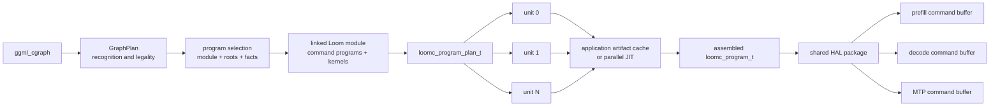

# Integrating Loom command programs into llama.cpp HRX

Loom command programs are a concrete replacement for the final C++ command
representation in an HRX graph planner. The graph planner still owns the work
that requires ggml knowledge: importing a `ggml_cgraph`, proving alias and
effect legality, recognizing semantic regions, and selecting an applicable
model schedule. Loom owns the selected schedule, kernel specialization,
dependency partitioning, artifact identity, executable loading, transient
placement, command-buffer recording, and launch evaluation.

This is the intended boundary:



`CommandPrograms` can remain the llama.cpp-side owner, but it no longer needs
to be another command IR. It can own the selected Loom program, its loaded HAL
package, materialized roots, launch-evaluation contexts, and the application
cache entries used to construct them.

## The authored program

A command program is an ordinary linkable Loom symbol. It is targetless: the
program describes portable command semantics, while each referenced kernel is
specialized and compiled for the selected hardware independently.

The complete Qwen3-30B decode witness is
[`kernels/decode_program.loom`](kernels/decode_program.loom). Its outer shape is
roughly:

```loom
config.def @qwen3_moe.model.hidden_size = 2048 : index
config.def @qwen3_moe.router.expert_count = 128 : index

kernel.decl @qwen_attention_metadata(
    %token_count: index, %context_capacity: index)
    launch(%token_count: index, %context_capacity: index,
           %control: buffer, %positions: buffer, ...)

command.program.def public @qwen3_30b_decode_576()
    launch(%parameters: buffer,
           %auxiliary_parameters: buffer,
           %key_cache: buffer,
           %value_cache: buffer,
           %request_state: buffer,
           %output_staging: buffer) {
  %output_weight = command.parameter
      %parameters, "output.weight"[] : view<255252480xi8, #dense>

  %projection_input = buffer.alloca %projection_bytes {
    base_alignment = 256, memory_space = global
  } : buffer

  scf.for %layer = [%layer_begin to %layer_end step %layer_step] unroll {
    // Parameter queries, views, typed kernel launches, and explicit ordering.
  }

  kernel.launch @qwen_greedy_argmax_partials[...] (...) : [...](...)
  command.return
}
```

The source remains compact because it retains normal Loom composition:
configuration values, templates and calls, structured loops and conditions,
parameter patterns, buffer packing, and typed kernel launches. Linking catches
a changed kernel signature at the source boundary. Specialization and ordinary
compiler optimization remove the source-level abstraction before the command
artifact is serialized.

One linked module may export several roots. Prefill, decode, MTP, or workload
classes can share the same kernel definitions and compiled dependency units.
Root selection and dead-code elimination determine which units are actually
produced; the API does not compile every program in a library eagerly.

## Resource and invocation ABI

The compiler derives the command-buffer ABI from provenance instead of asking
the hosting framework to duplicate it:

| Source value | Lifetime and representation |
| --- | --- |
| A buffer used by `command.parameter` | A fixed materialization-time buffer. Parameter keys become verified byte ranges within that buffer, and the buffer identity may be baked into the reusable command buffer. |
| Other `launch(...)` buffers | Rebindable issue-time slots. Request state, KV cache, outputs, and session-specific storage can change on every queue execution. |
| `buffer.alloca` storage | Compiler-packed into one reported transient slab with an exact required size and alignment. The application supplies the slab in its reported binding slot. |
| Host-dynamic launch values | Evaluated together into a small mapped host-local/device-visible workgroup-count table consumed by static indirect dispatches. Equivalent launch tuples are computed once. |
| Device-produced launch values | A future dynamic-indirect path; no device-to-host routing readback is required by the program representation. |

For the current decode root the compiler reports two fixed parameter roots,
580 concrete parameter ranges, five rebindable bindings, and one 225,536-byte
transient slab aligned to 256 bytes. The main GGUF-derived fixed root requires
18,550,716,416 bytes; the auxiliary root requires 256 bytes. These are queried
from the compiled program rather than copied into llama.cpp tables.

## Public C lifecycle

The public API deliberately separates planning, independent production, and
materialization. The omitted setup and cleanup below are conventional Loom C
handle ownership; the complete exercised call sequence is in
[`runtime/decode_command_program_test.cc`](runtime/decode_command_program_test.cc).

### 1. Prepare one immutable multi-root plan

```c
loomc_cmd_program_plan_options_t command_options = {
    .type = LOOMC_STRUCTURE_TYPE_CMD_PROGRAM_PLAN_OPTIONS,
    .structure_size = sizeof(command_options),
    .dependency_artifact_format =
        loomc_make_cstring_view(LOOMC_ARTIFACT_FORMAT_AMDGPU_HSACO),
};
loomc_program_plan_options_t plan_options = {
    .type = LOOMC_STRUCTURE_TYPE_PROGRAM_PLAN_OPTIONS,
    .structure_size = sizeof(plan_options),
    .next = &command_options,
};

loomc_program_plan_t* plan = NULL;
loomc_result_t* result = NULL;
loomc_status_t status = loomc_prepare_programs(
    compiler, coordinator_workspace, preparation_pass_program,
    unit_pass_program, linked_module, &plan_options, allocator, &plan,
    &result);
```

The plan owns the exact post-link production graph. It no longer borrows the
source module, compiler, or preparation workspace and is immutable and
thread-safe.

### 2. Cache or compile its units independently

```c
loomc_host_size_t unit_count = loomc_program_plan_unit_count(plan);
for (uint32_t i = 0; i < unit_count; ++i) {
  loomc_program_plan_unit_t unit = loomc_program_plan_unit_from_index(i);
  loomc_program_plan_unit_info_t info = {
      .type = LOOMC_STRUCTURE_TYPE_PROGRAM_PLAN_UNIT_INFO,
      .structure_size = sizeof(info),
  };
  loomc_program_plan_unit_info(plan, unit, &info);

  if (artifact_cache_lookup(info.cache_key, &artifacts, &artifact_count)) {
    loomc_program_plan_load_unit_program(
        plan, unit, artifacts, artifact_count, allocator,
        &unit_programs[i], &unit_results[i]);
  } else {
    loomc_program_plan_compile_unit(
        plan, worker_workspaces[i], unit, NULL, allocator,
        &unit_programs[i], &unit_results[i]);
    artifact_cache_store(info.cache_key, unit_programs[i]);
  }
}
```

The loop illustrates ownership, not scheduling. Production submits cache
misses concurrently; each call uses a distinct workspace and no compilation
lock spans a compiler invocation. Cache lookup/insertion is the only shared
critical section. Cache keys come from the compiler and identify exact unit
inputs, so the application never reconstructs identity from kernel names or
configuration strings. `artifact_cache_lookup` and `artifact_cache_store` are
application pseudocode above; cache storage contains the direct artifacts
enumerated from each `loomc_program_t`.

### 3. Assemble only the selected roots

```c
loomc_program_plan_unit_table_t unit_table = {
    .type = LOOMC_STRUCTURE_TYPE_PROGRAM_PLAN_UNIT_TABLE,
    .structure_size = sizeof(unit_table),
    .programs = unit_programs,
    .program_count = unit_count,
};

loomc_program_t* program = NULL;
loomc_program_plan_assemble(
    plan, coordinator_workspace, selected_roots, selected_root_count,
    &unit_table, NULL, allocator, &program, &result);
```

Assembly performs no implicit compilation. The resulting program retains its
ancillary units and may export several roots that share them.

### 4. Load once and materialize reusable command buffers

```c
loomc_program_export_t root_export;
loomc_program_lookup_export(program,
                            loomc_make_cstring_view("qwen3_30b_decode_576"),
                            &root_export);

loomc_cmd_program_t* command_program = NULL;
loomc_cmd_program_create_from_export(
    program, root_export, allocator, &command_program);

loomc_cmd_iree_hal_package_t* package = NULL;
loomc_cmd_iree_hal_package_create(
    program, &package_options, allocator, &package);

loomc_cmd_iree_hal_program_t* hal_program = NULL;
loomc_cmd_iree_hal_program_create(
    package, command_program, &materialization_options, allocator,
    &hal_program);
```

The package loads shared ancillary executables and the aggregate host launch
module once. Materialization records a selected root, captures its fixed
parameter buffers, and leaves its reported issue-time slots unresolved. A
package can materialize several roots without loading their shared executables
again.

At issue time, a caller evaluates the root's launch function directly into a
persistently mapped launch-count buffer when the root has dynamic workload
arguments, fills the reported HAL binding table, and submits the borrowed
reusable command buffer with `iree_hal_device_queue_execute`. There is no graph
walk, linking, JIT, allocation planning, parameter lookup, or command recording
on this path. The complete AMDGPU example—including fixed parameters,
transients, dynamic launch evaluation, two roots sharing one executable, and
real queue execution—is
[`amdgpu_lifecycle_test.cc`](../../loom/src/loom/target/arch/cmd/iree_hal/amdgpu_lifecycle_test.cc).

## Mapping this onto Graph2

The useful Graph2 work survives this boundary. Its `GraphPlan`, source/effect
index, semantic regions, legality proofs, and recipe selection determine which
known Loom program and roots apply, plus the configuration and binding facts
needed to specialize them. For a known architecture such as Qwen3-30B, that
selection should normally reference a pre-authored module rather than generate
hundreds of C++ dispatch records.

The current proposed `CommandProgram::Builder` boundary can contract into a
program-selection result with these fields:

- linked Loom module or stable module-library identity;
- one or more public root names;
- source configuration and kernel target specializations;
- fixed parameter-buffer roots and the ggml storage ranges backing them; and
- rebindable runtime resources associated with the selected root ABI.

The compiler then owns partitioning, kernel dependency slots, transient live
ranges, command serialization, and the exact ABI query. A graph UID remains a
valuable front-end cache key for the selected plan. Compiler-provided unit keys
form the lower artifact cache. The final cache value is the materialized HRX
execution package, not a replayable C++ description that must be interpreted
and recorded again.

The model-storage boundary matters. The current Qwen root assumes one stable,
GGUF-order resident parameter slab plus one small derived-data slab. A backend
whose model weights occupy many independently addressed allocations can either
gather them once while loading the model or author several explicit parameter
roots. It should not turn hundreds of parameter ranges into per-dispatch
bindings: stable parameter roots are what let materialization bake weight
addresses once, while KV cache and request buffers remain cheaply rebindable
per session.

The resulting llama.cpp hot and cold paths are distinct:

| Event | Work |
| --- | --- |
| New graph or schedule class | Import and recognize the cgraph, select a Loom module/root/configuration, and prepare a plan. |
| Unit cache miss | Compile only the missed units, concurrently, then store their direct artifacts. |
| New model/device package | Load shared executables once and bind stable parameter roots. |
| New session or shape class | Materialize or retrieve the appropriate reusable root command buffer. |
| Every token | Publish dynamic launch values when present, supply rebindable buffers, and queue the command buffer. |

Token position is issue-time data, never a compilation or recording identity.
Shape ranges may select a small number of schedule classes when a kernel truly
requires them; every position within one class shares the same materialized
program.

This division also keeps the fallback honest. An unrecognized ggml operation
can remain a primitive or explicit missing-kernel result in Graph2 without
forcing the optimized model program to model every ggml node. Adding a fusion
or replacing a schedule becomes an authored Loom change; the hosting backend's
command representation and issue path do not change.

## Current proof boundary

The generic command-program stack already executes reusable multi-root command
buffers on AMDGPU through the public APIs above. The production-shaped Qwen
witness currently proves a narrower boundary: its targetless 48-layer decode
root prepares successfully, partitions into one root unit plus 14 independently
compiled kernel units, assembles those units, opens the portable command
artifact, and reports the complete fixed/rebindable resource ABI.

That Qwen test does not yet materialize and issue the full 30B decode root. The
next vertical slice is intentionally singular: feed the assembled Qwen program
through the already exercised HAL package/materialization API, bind the owned
runtime's real GGUF slab, KV caches, request state, output, and transient slab,
then compare the selected token. Completing that slice replaces the last
production ownership boundary; it does not require another Graph2 or
`CommandPrograms` redesign.
